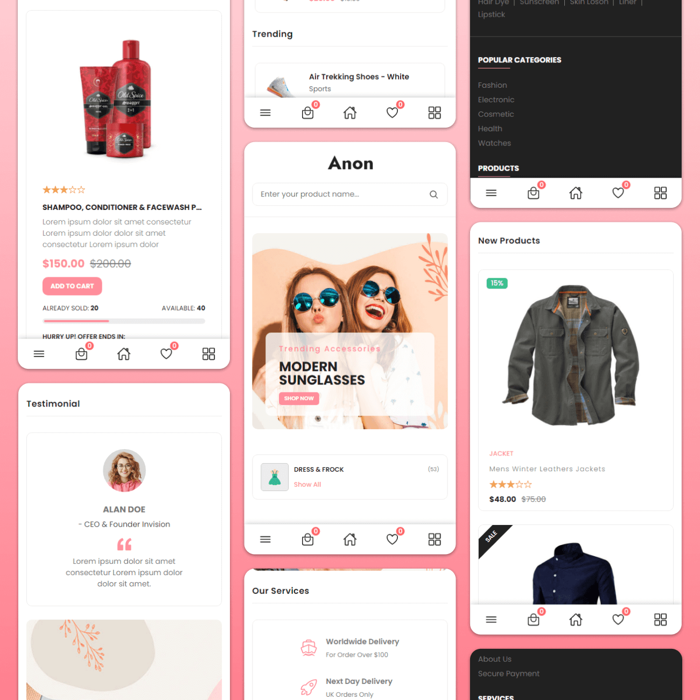

# Anon - Modern & Fully Functional eCommerce Website

[](https://opensource.org/licenses/MIT)
[](https://html.spec.whatwg.org/)
[](https://www.w3.org/Style/CSS/)
[](https://developer.mozilla.org/en-US/docs/Web/JavaScript)
[](https://nodejs.org/)

**Anon** is a modern, fully functional, and responsive eCommerce web application built with vanilla HTML5, CSS3, and ES6+ JavaScript. It features an interactive shopping cart, wishlist system, live product search with dropdown suggestions, quick view modal, multi-currency price conversions, deal of the day countdown timers, social proof notifications, and checkout simulation.

---

## 📸 Preview & Screenshots

| Desktop Showcase | Mobile Showcase |
| :---: | :---: |
|  |  |

---

## ✨ Features

### 🛍️ E-Commerce Core
- **Interactive Slide-In Cart Drawer**:
  - Add products to cart from minimal showcases, product grid, deal of the day, or quick view modal.
  - Quantity controls (`+` / `-`), remove items, and empty state.
  - Live Free Shipping threshold tracker (`$55` progress bar with visual meter).
  - Promo code engine (`ANON20` for 20% discount).
  - Subtotal, shipping, discount, and total calculations with persistent `localStorage`.
- **❤️ Wishlist Drawer**:
  - Heart toggle buttons across all product cards.
  - Slide-in wishlist drawer with "Move to Cart" and "Remove" options.
  - Live wishlist badge count in header and mobile bottom bar.
- **👁️ Quick View Product Modal**:
  - Detailed product view with thumbnail image gallery switcher.
  - Star ratings and customer review counts.
  - Size selector (`S`, `M`, `L`, `XL`), quantity picker, and stock availability indicator.
  - Direct Add to Cart & Add to Wishlist actions.

### 🔍 Search & Filtering
- **Live Search Suggestions**: Real-time dropdown preview showing product image, title, category, and price as you type.
- **Product Grid Filtering**: Instant category and search filtering with active filter pills and a "Clear Filter" button.
- **Category Accordions & Pills**: Interactive category pills and sidebar accordions for filtered browsing.

### 💱 Dynamic Site-Wide Multi-Currency Converter
- Real-time currency selector in top header:
  - **USD ($)**: US Dollar
  - **EUR (€)**: Euro
  - **GBP (£)**: British Pound
  - **INR (₹)**: Indian Rupee
- Automatically converts and updates **every single price** on the entire site (header free shipping alert, hero banners, minimal showcases, deal of the day, product grid, best sellers, cart, wishlist, and quick view modal).

### ⏱️ Deals & Social Proof
- **Deal of the Day Real-Time Countdown**: Live ticking timer (Days, Hours, Minutes, Seconds) with dynamic stock progress meter.
- **Recent Purchase Toast Notifications**: Simulated real-time buyer toasts ("Someone in New York just bought...") cycling periodically.
- **Newsletter Subscription Popup**: Interactive modal with validation and `localStorage` persistence.
- **Action Alert Toasts**: Animated instant notification banners for cart and wishlist actions.

### 💳 Simulated Checkout & Order Confirmation
- Multi-step checkout modal with shipping address inputs and payment method selectors (Credit Card, PayPal, Cash on Delivery).
- Order review calculation and validation.
- Celebratory order confirmation modal with unique Order Tracking ID (`#ANON-XXXXXX`).

### 📱 Responsive Mobile Experience
- Fixed mobile bottom navigation bar with live cart and wishlist badge counters.
- Slide-out mobile navigation menu drawer and categories sidebar.

---

## 🚀 Getting Started & Local Setup

### Prerequisites
- [Node.js](https://nodejs.org/) (v16 or higher) **or** [Python](https://python.org/) installed on your machine.

### Installation & Running Locally

1. **Clone the Repository**:
   ```bash
   git clone https://github.com/eleshkapri/E-commerc.git
   cd E-commerc
   ```

2. **Start the Local Server**:
   Using the built-in Node.js server (zero dependencies required):
   ```bash
   node server.js
   ```
   *Alternatively, using Python:*
   ```bash
   python -m http.server 3000
   ```

3. **Open in Browser**:
   Navigate to:
   ```
   http://localhost:3000
   ```

---

## 📂 Project Structure

```
E-commerc/
├── index.html                   # Master HTML5 markup with all drawers & modals
├── server.js                    # Zero-dependency Node.js static HTTP server
├── README.md                    # Project documentation
├── assets/
│   ├── css/
│   │   ├── style.css            # Complete design system, layouts & animations
│   │   └── style-prefix.css     # CSS compatibility bundle
│   ├── js/
│   │   ├── products-data.js     # Centralized product catalog database
│   │   └── script.js            # Master application logic & state managers
│   └── images/
│       ├── banner-*.jpg         # Hero slider images
│       ├── blog-*.jpg           # Blog post images
│       ├── cta-banner.jpg       # CTA section background
│       ├── icons/               # SVG category & system icons
│       ├── logo/                # Brand logo and favicon
│       └── products/            # Product image catalog
└── website-demo-image/          # Demo screenshots
```

---

## 🛠️ Built With

- **HTML5**: Semantic tags, accessible landmarks, and clean structure.
- **CSS3**: Custom properties (CSS variables), Flexbox, CSS Grid, animations, and media queries.
- **JavaScript (ES6+)**: Modular state architecture, DOM manipulation, and `localStorage` API.
- **Ionicons**: Crisp vector icon library.
- **Google Fonts**: Poppins typeface.

---

## 📄 License

This project is licensed under the MIT License - see the [LICENSE](LICENSE) file for details.
